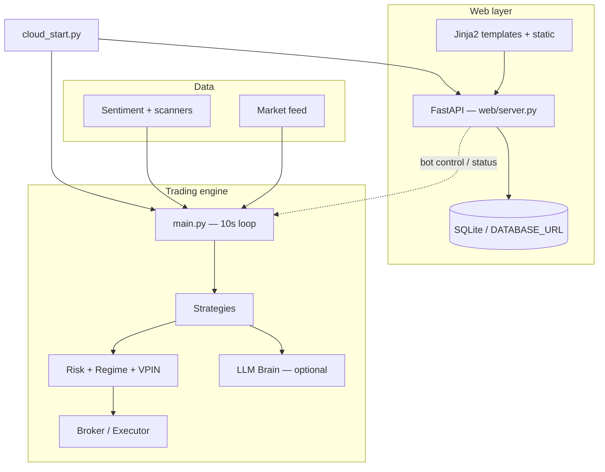

# Ferchaud

Autonomous multi-strategy trading platform with a FastAPI web app, optional LLM judgment layer, and production supervisor for 24/7 cloud deployment. Ferchaud is built as **groundwork for AI-driven automation**: it bundles market data, strategy logic, risk controls, execution, and observability so agents (or humans) can run the stack with clear configuration and health endpoints.

> **Not financial advice.** Trading involves substantial risk of loss. Paper trading is the default. Read the in-app risk disclosure before enabling live trading.

## Features

- **Parallel strategy engine** — Mean reversion, momentum, stat arb, scalper, catalyst, multi-factor ML, gap short, options catalyst, aggressive breakout, and more; combined via an alpha combiner with risk-parity or fixed weights.
- **Risk & market structure** — Portfolio risk caps, drawdown halt, Kelly sizing, vol targeting, HMM regime detection, VPIN toxicity monitor.
- **LLM judgment layer** — Claude (Anthropic) or Grok (xAI) can ratify, veto, and explain candidate signals; rule-based fallback when no API key is set.
- **Adaptive learning** — Trade journal and per-strategy “arms” that tune over time.
- **Multi-broker adapters** — Alpaca (primary), plus Robinhood, Webull, IBKR, Tradier, Coinbase, Binance, Bybit, Kraken, and others under `core/brokers/`.
- **Web dashboard** — Landing, dashboard, analytics, live feed, connections, auth (Supabase), Stripe subscriptions, and legal pages.
- **Cloud-ready** — `cloud_start.py` runs the web server and bot under one supervisor with `/health`, `/livez`, `/readyz`, and `/metrics`.

## Architecture



## Requirements

- Python **3.11+**
- [Alpaca](https://alpaca.markets) API keys (paper or live)
- Optional: `ANTHROPIC_API_KEY`, `XAI_API_KEY`, Supabase, Stripe, `DATABASE_URL` for production web

## Quick start

```bash
git clone https://github.com/Bibue35/ferchaud.git
cd ferchaud

python3 -m venv .venv
source .venv/bin/activate   # Windows: .venv\Scripts\activate

pip install -r requirements.txt
cp .env.example .env
# Edit .env — at minimum set ALPACA_API_KEY and ALPACA_SECRET_KEY

mkdir -p logs data
./start.sh
```

Open [http://localhost:3000](http://localhost:3000) for the web UI. The trading bot logs to `logs/bot.log`.

### Start modes

| Command | Description |
|---------|-------------|
| `./start.sh` | Web server + bot |
| `./start.sh --web` | Web only |
| `./start.sh --bot` | Bot only |
| `python3 main.py` | Bot directly (no web) |
| `python3 cloud_start.py` | Production supervisor (web + bot thread) |

## Configuration

All bot settings load from `.env` via `config.py`. See `.env.example` for:

- **Trading** — `TRADING_MODE` (`paper` \| `live`), universes, stat-arb pairs, order type (market, limit, TWAP, VWAP)
- **Risk** — `MAX_PORTFOLIO_RISK`, `MAX_DRAWDOWN`, `MAX_POSITION_SIZE`, leverage bounds
- **Strategies** — `STRATEGY_*` toggles and optional `STRATEGY_WEIGHT_*` overrides
- **Regime / VPIN** — HMM and toxicity halt thresholds
- **Backtest** — `BACKTEST_ENABLED=true` to run backtest instead of live loop

Web-specific variables (set as needed):

| Variable | Purpose |
|----------|---------|
| `DATABASE_URL` | SQLAlchemy URL (default: SQLite in `data/`) |
| `SUPABASE_URL`, `SUPABASE_ANON_KEY` | Auth |
| `STRIPE_SECRET_KEY`, `STRIPE_WEBHOOK_SECRET`, `STRIPE_PRICE_*` | Billing |
| `PORT` | HTTP port (default `3000`; cloud hosts often set this) |

## Deployment

### Docker / Railway

```bash
docker build -t ferchaud .
docker run --env-file .env -p 3000:3000 ferchaud
```

The image runs `python3 -u cloud_start.py`. Railway uses `railway.json` with health check on `/livez`.

### Vercel (web only)

Serverless entry: `api/index.py` → `web.server:app`. Use `requirements-web.txt`. The full trading bot is not suitable for Vercel; run the worker on Railway, Fly.io, Render, or a VPS.

### Heroku-style Procfile

- `web`: `python3 -u cloud_start.py`
- `worker`: `python3 -u main.py` (separate dyno if you split web and bot)

## Project layout

```
ferchaud/
├── main.py              # QuantBot v2 trading loop
├── cloud_start.py       # Web + bot supervisor
├── config.py            # Central .env config
├── core/                # Broker, risk, regime, VPIN, learning, execution
├── strategies/          # Strategy implementations
├── data/                # Feeds, sentiment, scanners
├── web/                 # FastAPI app, templates, auth, Stripe
├── api/                 # Vercel entrypoint
├── integrations/        # e.g. Freqtrade adapter
├── dashboard/           # Auxiliary dashboard app
├── design.md            # UI/UX design system (source of truth)
├── start.sh             # Local combined startup
├── Dockerfile
└── requirements.txt
```

## Web routes

| Path | Description |
|------|-------------|
| `/` | Landing |
| `/dashboard` | Main app |
| `/analytics` | Learning insights, equity, strategy arms |
| `/feed` | Live trades and signals |
| `/how-it-works` | Transparency guide |
| `/login`, `/signup` | Auth |
| `/health`, `/livez`, `/readyz`, `/metrics` | Ops / supervisor |

See `design.md` for voice, colors, and UX rules.

## Strategies (high level)

Enabled via `STRATEGY_*` flags in `.env`:

| Strategy | Flag |
|----------|------|
| Mean reversion | `STRATEGY_MEAN_REVERSION` |
| Momentum | `STRATEGY_MOMENTUM` |
| Stat arb | `STRATEGY_STAT_ARB` |
| Multi-factor (ML) | `STRATEGY_MULTI_FACTOR` |
| Scalper | `STRATEGY_SCALPER` |
| Catalyst | `STRATEGY_CATALYST` |
| Aggressive breakout | `STRATEGY_AGGRESSIVE_BREAKOUT` |
| Market making | `STRATEGY_MARKET_MAKING` (needs L2; off by default) |

Additional modules exist under `strategies/` (pairs trading, ETF rotation, merger arb, etc.) and can be wired in `main.py` as needed.

## For AI agents

This repo is intended as a **single bundle of sources** for autonomous operation:

1. Copy `.env.example` → `.env` and fill credentials.
2. Prefer `TRADING_MODE=paper` until explicitly approved for live.
3. Use `cloud_start.py` in production; poll `/health` for `bot_running`, `bot_restart_count`, and learning summary.
4. Read `design.md` before changing UI; read `config.py` and `.env.example` before changing behavior.
5. Strategy and risk changes should go through `main.py`, `core/risk.py`, and the relevant `strategies/*.py` files.

Agent skill folders (`.agents`, `.claude`, etc.) may ship with the repo for tool-specific workflows.

## License

Licensed under the [Apache License 2.0](Apache%20License). See the `Apache License` file in this repository.

## Links

- Repository: [github.com/Bibue35/ferchaud](https://github.com/Bibue35/ferchaud)
- Alpaca: [alpaca.markets](https://alpaca.markets)
